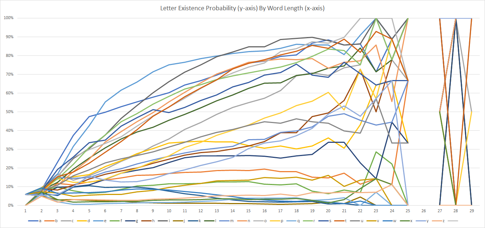

# hangman
Play hangman against a n-grams language model AI. 

# Instructions
Clone this repo and run the following in the command line:  
```bash 
python start.py
```

# Guessing Strategy
My strategy is to guess letters based on an n-grams model trained on the curated dictionaries. The final strategy actually is an interpolation of 8 n-grams models. To begin, the class instance creates the n-gram distributions for n=1...8 by going through the dictionary. A special case is taken for n=1, where the distribution is not for letter occurrence, but for letter existence based on word length; in other words, letters will only be counted max once per word even if they appear multiple times within the word, and the distributions are recorded for each observed word length . This is because initial guesses on the blank word want to be optimized for probability of guessing a correct letter, not necessarily a correct letter with lots of occurrences because the larger n-gram models will presumably be better at guessing letters once some initial letters have been uncovered. Some light digging in the provided dictionary (later shown in Note 2) shows that there actually are some differences in the most commonly existing letters across different word lengths.

During a game, each n-gram model looks at the word and the n-grams within the word. Based on the observations, each n-gram model forms a conditional probability distribution across letters based on the n-grams it sees and matches in the word provided. For example, if the current word is " h.l.o. " (notice the spaces at the start and end of the word), where "."s represent missing letters, all n-grams of the word are checked against the prior distribution of n-grams; each n-gram holds a weight (number of times n-gram has occurred in dictionary).

For example, if n=3 and if the prior distribution only contains
```
{
    "on ": 200,
    "eal": 500,
    "llo": 400,
    "hal": 400,
    "lio": 500,
},
```
then the n-grams (3-grams) from the words that match words in the prior distribution are where there is only one missing letter (i.e. ".l." matches "llo", but there are 2 missing letters so it is not considered in the calculation):

"o. " matches "on ",
"l.o" matches "llo", "lio",
"h.l" matches "hal",

Each pairing between the n-grams (3-grams) and words in the prior distribution is recorded in a dictionary which stores the total weight per candidate letter. For the example above, the dictionary, or posterior distribution of letter weights, would become:

```
{
    "l" : 400 + 400,
    "i" : 500,
    "e" : 500,
    "a" : 400,
    "n" : 200,
}
```

In this case, "l" ends up having the highest total weight (which is then divided by the total weights across every candidate letter to get the probability), so our model says there's ~33% chance "l" is a letter in the word. There's ~20% "i" is in the word, ~20% "e" is in the word, ~17% "a" is the word, etc.

Finally, the "guess()" method which returns the final letter to guess uses the interpolated score of (1...n)-gram models'. The final letter is calculated based on the final score of each letter based on their probabilities from each of the (1...n)-gram models and the weights assigned to each of the (1...n)-gram models. 

**Some notes**: 
***Note 1***: " "s from candidate letters because we know for a fact there are no " "s in the word besides at the start and end. Including " "s in the n-gram model training was a key insight which led to some improvement because it allowed the model to "learn" a bit about common prefixes and suffixes. 
***Note 2***: Letter existence probability distribution across word lengths need to take into account sample sizes because there are some word lengths that do not appear that often in the dictionary (and the english language); for example, 26-length words do not appear in the dictionary at all. Because of this, the word lengths are winsorized between [3, 19] because every other larger and smaller word length sample size is < 1000. Also, letter existence probabilities seemed to have some significant changes based on word length, as evident from the chart below from an analysis of the dictionary: 



Just as an example, "y" exists in ~20% of 11 length words, but 40% of 19 length words! Though, we only really care about the top couple of letters, which are generally more consistent (e.g. i, e, t, a, r, s) but sometimes switch rankings between them. Nevertheless, this is still interesting to note and could be an avenue for future improvements.
